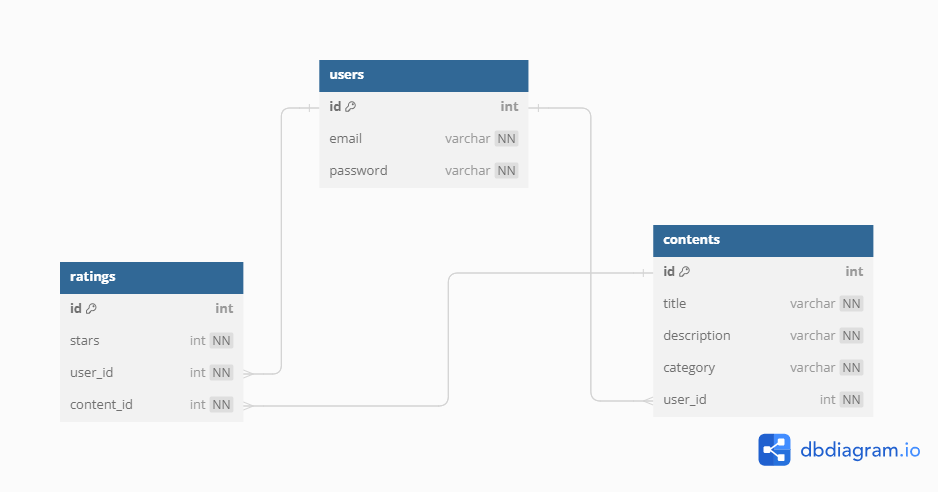

# Content Sharing Platform API

This project is a backend API for a content-sharing platform that manages user-generated content, including games, videos, artwork, and music.

The project is hosted on [Render](https://render.com): [Content Sharing Platform API](https://backend-blue-gravity-assignment.onrender.com)

**Note**: Render free tier will spin down with inactivity, which can delay requests by 50 seconds or more.

## Table of Contents

1. [Project Setup](#project-setup)
2. [API Endpoints](#api-endpoints)
3. [Database Schema](#database-schema)
4. [Installation](#installation)
5. [Running the App](#running-the-app)
6. [Testing](#testing)
7. [Usage](#usage)

## Project Setup

This project uses Node.js with the NestJS framework. It includes the necessary dependencies and configurations to manage user-generated content and user authentication.

### Dependencies

- Node.js
- NestJS
- TypeORM
- PostgreSQL
- JWT for authentication

## API Endpoints

For detailed API information and testing, access the Swagger documentation at: [Swagger Documentation](https://backend-blue-gravity-assignment.onrender.com/api)

## Database Schema



## Installation

Clone the repository:

```bash
git clone https://github.com/HumamHusamEldeenGithub/backend-blue-gravity-assignment.git
```

Navigate to the project directory:

```bash
cd backend-blue-gravity-assignment
```

Install the dependencies:

```bash
npm install
```

Set up environment variables in a `.env` file:

```text
ENV=DEV
JWT_SECRET=secret

PG_PORT_DEV=5432
PG_USERNAME_DEV=yourusername
PG_PASSWORD_DEV=yourpassword
PG_DB_DEV=yourdbname
```

For production environment, set these variables:

```text
ENV=PROD
JWT_SECRET=secret

PG_PORT_PROD=db_port
PG_USERNAME_PROD=your_username
PG_PASSWORD_PROD=your_password
PG_DB_PROD=your_db_name
PG_HOST_PROD=host_url
PG_CA_PATH_PROD=path_of_certificate
```

## Running the App

```bash
# development
npm run start

# watch mode
npm run start:dev

# production mode
npm run start:prod
```

## Testing

```bash
# unit tests
npm run test

# e2e tests
npm run test:e2e
```

## Usage

- **Running the Server:**

  - The server will run on http://localhost:3000.

- **Accessing API Endpoints:**
  - Use an API client like Postman or Insomnia to interact with the API.
  - For protected routes, include the JWT token in the Authorization header as `Bearer <token>`.
